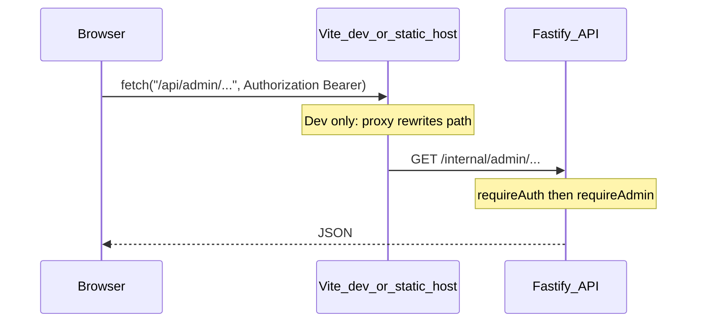

# Connecting admin UI to the backend

## How traffic flows today

1. **Client helper** — [`frontend/client/src/lib/admin-api.ts`](frontend/client/src/lib/admin-api.ts) `adminFetch()` attaches the WorkOS/Clerk JWT (`getExternalAuthToken()`), sets `credentials: "include"`, and uses relative URLs (e.g. `/api/admin/...`). It **returns parsed JSON** (not `Response`); callers must not call `.json()` on the result.
2. **Dev proxy** — [`frontend/vite.config.ts`](frontend/vite.config.ts) maps **`/api/admin` → `/internal/admin`** via `rewrite`. Full server path: **`/internal/admin/...`** (see [`server/src/app.ts`](server/src/app.ts): admin routes under `prefix: '/internal'`).
3. **Direct `/internal` calls** — Some code uses **`/internal/admin/phase4-mode`** ([`reference-input.tsx`](frontend/client/src/components/reference-input.tsx), [`AdminSettings.tsx`](frontend/client/src/components/AdminSettings.tsx)). Vite proxies `/internal` to the backend without rewriting.
4. **Auth** — Admin routes use `requireAuth` + `requireAdmin` on the `/internal` scope. JWT missing or non-admin → 401/403.

---

## Target: rich analytics (no mocks) — single API contract

### Backend: new module `server/src/routes/admin-analytics.ts`

Register **`adminAnalyticsRoutes`** **inside the same Fastify scope** that already applies `requireAuth` + `requireAdmin` + `prefix: '/internal'` (see [`server/src/app.ts`](server/src/app.ts) `adminRoutes` callback). The route handler should register as **`/admin/analytics/summary`** on that scope (full URL **`GET /internal/admin/analytics/summary`**). Do **not** add a second `prefix: '/internal'` on `register()` or paths will double.

**Response shape** (canonical contract — align names with frontend types):

- **`window`**: `{ days, from, to }` ISO strings for `from`/`to`.
- **`pipeline`**: `totalJobs`, `jobsByStatus`, `totalCitations`, `citationsByStatus`, `avgRefsPerJob`, `avgJobDurationMs`, `queueDepth`.
- **`quality`**: `correctionRate`, `needsReviewCount`, `needsActionCount`, `highConfidenceRate` (rates 0–1).
- **`providers`**: `crossref`, `openalex`, `openai`, `ml` with the fields in the spec (calls, cache hits, bytes/tokens as applicable).
- **`reports`**: counts by status, `resolutionRatePercent`, `avgResolutionHours` (nullable).
- **`users`**: `total`, `newInWindow`, `activeInWindow`, `byPlan`.
- **`egress`**: `dailyBuckets`, `totalBytesInWindow`, `avgBytesPerCitation`.
- **`timeSeries`**: `jobs`, `citations`, `errors` — daily `{ date, count }[]`.

**Query**: `?days=` capped (e.g. max 90), default 30.

### Repo alignment (spec code must be adapted — do not copy paths verbatim)

| Spec snippet | Use in this repo |
| ---------------- | ---------------- |
| `../db/index.js`, raw `db.query()` | [`server/src/db/connection.js`](server/src/db/connection.js) `db` + Drizzle or `sql` template; **`users` table** must match [`server/src/db/schema.ts`](server/src/db/schema.ts) (column names for plan / created_at). |
| `../lib/redis.js`, `redis.keys` | [`server/src/redis/client.ts`](server/src/redis/client.ts) (or Upstash REST) — **avoid `KEYS` in production**; prefer known key patterns or existing rollups. If provider/egress keys do not exist yet, return **zeros** until instrumentation writes them. |
| `j.citations`, `c.status` | `StoredJob` uses **`job.result?.references`** ([`ProcessedCitation`](server/src/engine/types/citation.ts)): use **`publicStatus`** / **`status`** as defined there, not a fictional `c.citations` array on the job. |
| `j.userId` | Confirm `StoredJob` / job summary has a user id field; if absent, **`activeInWindow`** may use another signal or 0 until schema supports it. |
| `j.status === 'queued'` | Match actual job status union (e.g. `pending` / `processing` — see [`store.ts`](server/src/runtime/store.ts) / DB). |
| `r.resolvedAt` on reports | [`StoredReport`](server/src/runtime/store.ts) may **not** have `resolvedAt`; compute resolution time only if stored, else **`avgResolutionHours`: null** or derive from status change audit if added later. |
| `c.corrected` | May not exist on `ProcessedCitation` — derive **correction rate** from [`listCorrections`](server/src/runtime/persistence.ts) or field-level flags that exist. |
| Time series SQL on `jobs` | Table/columns must match Drizzle schema ([`server/src/db/schema.ts`](server/src/db/schema.ts)); use `citation_count` only if the column exists, else aggregate from JSONB. |

**Implementation strategy:** Implement **full JSON shape** always; use **real aggregates** where data exists and **structured zeros** where Redis/egress/provider keys are not yet written, so the UI never needs mock arrays.

---

## Frontend: shared type + data loading

### Shared type

- Add [`frontend/client/src/types/analytics.ts`](frontend/client/src/types/analytics.ts) (or under [`frontend/shared`](frontend/shared) if reused outside client) exporting **`AnalyticsSummary`** matching **`AnalyticsSummaryResponse`** above.

### Data loading (prefer React Query — do not duplicate `adminFetch` + `.json()`)

- **`adminFetch<T>` already returns parsed body** — the spec’s `useAnalyticsSummary` with `.then(r => r.json())` is **incorrect** for this codebase.
- Use **`useQuery`** + `queryFn: () => adminFetch<AnalyticsSummary>(\`/api/admin/analytics/summary?days=${days}\`)` keyed by `["/api/admin/analytics/summary", days]` (same pattern as existing admin components).
- Optional: thin `useAnalyticsSummary(days)` hook that **wraps `useQuery`** only.

### Per-tab UI (replace mocks)

1. **[`AdminDashboard.tsx`](frontend/client/src/components/AdminDashboard.tsx)** — KPI grid from `pipeline`, `quality`, `users`, `reports`, `egress`, `providers.openai` tokens; line chart(s) from **`timeSeries.jobs`** (and optionally citations).
2. **[`AdminAnalytics.tsx`](frontend/client/src/components/AdminAnalytics.tsx)** — Provider table (`providers.*`); egress line chart from **`egress.dailyBuckets`**; keep **reports alerts** from existing **`/api/admin/reports/grouped`** if still desired.
3. **[`AdminSystemHealth.tsx`](frontend/client/src/components/AdminSystemHealth.tsx)** — Citation status pie from **`pipeline.citationsByStatus`**; error line from **`timeSeries.errors`**; jobs-by-status bar from **`pipeline.jobsByStatus`**.

Remove **`buildTrendSeries` / static pie slices** where real series exist.

---

## Production routing (`doc-proxy-prod`)

**Option A — Env base URL (spec):** In [`admin-api.ts`](frontend/client/src/lib/admin-api.ts), prefix requests with `import.meta.env.VITE_API_BASE_URL ?? ''` so production Pages uses `VITE_API_BASE_URL=https://api.<domain>` and dev leaves it empty (Vite proxy unchanged).

**Option B — Edge same-origin:** Route `/api/admin/*` on the host to the API Worker/origin (e.g. Cloudflare `routes` / Worker) so the browser stays same-origin and cookies/credentials behave predictably.

Document in [`.env.example`](.env.example): `VITE_API_BASE_URL=` for local dev.

---

## What is already wired

| UI area | Frontend path | Backend | Status |
| -------- | ------------- | ------- | ------ |
| Reports queue / detail / alerts | `/api/admin/reports/...` | [`admin.ts`](server/src/routes/admin.ts) | Implemented |

---

## Remaining gaps (unchanged)

- **`GET /api/admin/references`** — [`AdminReferences.tsx`](frontend/client/src/components/AdminReferences.tsx) — not implemented server-side.
- **`POST /api/admin/approve`** — [`admin-approve.tsx`](frontend/client/src/pages/admin-approve.tsx) — not implemented.

---

## Recommended implementation order

1. **`admin-analytics.ts` + registration** — Full contract; zeros for missing Redis/provider keys; DB/time-series aligned to schema.
2. **Frontend types + three admin screens** — Remove mocks; React Query + `adminFetch`.
3. **`VITE_API_BASE_URL` + docs** — [`admin-api.ts`](frontend/client/src/lib/admin-api.ts) + `.env.example`.
4. **`/admin/references`** — Pagination over jobs.
5. **`/admin/approve`** or retire page.
