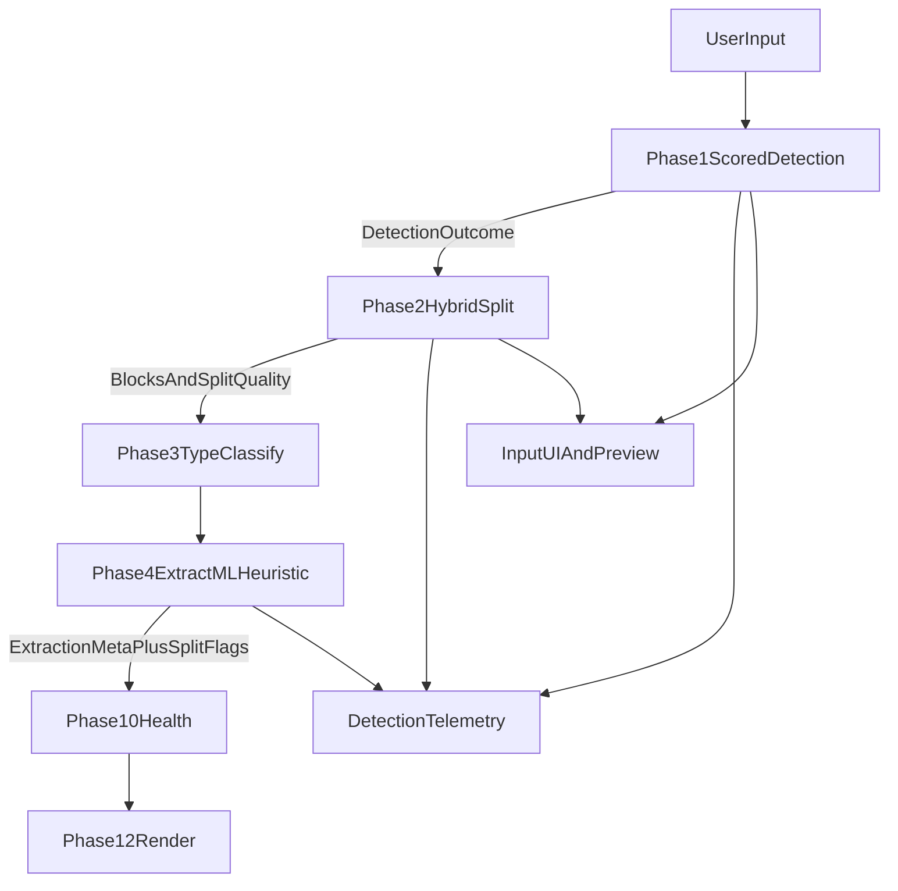

# Scored Detection + Scalable Rollout Plan

## Goals

- Improve **quality/accuracy** of input format detection and split boundaries.
- Preserve or improve **speed/performance** with bounded CPU overhead.
- Minimize **early-stage cost** using feature flags, sampling, and staged rollout.
- Keep contracts and architecture **upgradeable for scale** (new detectors, higher volume, richer telemetry).

## Definitions and Decision Rules

- Confidence math (normalized margin):
  - `margin = topScore - secondScore`
  - `confidence = sigmoid(k * margin)` with default `k=8` (calibrated later).
- Sampling adjustment:
  - `effectiveConfidence = sampled ? confidence * 0.85 : confidence`.
- Usage rule:
  - Backend quality/control-flow logic uses raw `confidence`.
  - UI/user-facing gates and prompts use `effectiveConfidence`.
- Correction-rate metric definition:
  - `correctionsPer1000 = (totalCorrections / totalConversions) * 1000`.

## Scope and File Targets

- Engine ingest/detect: [server/src/engine/phases/phase1Ingest.ts](server/src/engine/phases/phase1Ingest.ts)
- Ingestion contracts: [server/src/engine/types/ingestion.ts](server/src/engine/types/ingestion.ts)
- API contracts: [server/src/engine/types/api.ts](server/src/engine/types/api.ts)
- Inspect route response: [server/src/routes/inspect.ts](server/src/routes/inspect.ts)
- Split strategies/hybrid fallback: [server/src/engine/phases/phase2Split.ts](server/src/engine/phases/phase2Split.ts)
- Phase 4 uncertainty propagation: [server/src/engine/phases/phase4Extract.ts](server/src/engine/phases/phase4Extract.ts)
- Health reasoning/warnings: [server/src/engine/phases/phase10Health.ts](server/src/engine/phases/phase10Health.ts), [server/src/engine/healthWarnings.ts](server/src/engine/healthWarnings.ts)
- Render scoring path guard: [server/src/engine/phases/phase12Render.ts](server/src/engine/phases/phase12Render.ts)
- Runtime enums/validation: [server/src/engine/types/runtime-enums.ts](server/src/engine/types/runtime-enums.ts)
- Frontend API/types/input UX: [frontend/client/src/lib/engine-types.ts](frontend/client/src/lib/engine-types.ts), [frontend/client/src/lib/engine-api.ts](frontend/client/src/lib/engine-api.ts), [frontend/client/src/components/reference-input.tsx](frontend/client/src/components/reference-input.tsx)
- Tests (unit/integration):
  - [server/test/unit/engine/phases/phase1Ingest.test.ts](server/test/unit/engine/phases/phase1Ingest.test.ts)
  - [server/test/unit/engine/phases/phase2Split.test.ts](server/test/unit/engine/phases/phase2Split.test.ts)
  - [server/test/unit/engine/phases/phase4Extract.test.ts](server/test/unit/engine/phases/phase4Extract.test.ts)
  - [server/test/integration/inspectRoute.test.ts](server/test/integration/inspectRoute.test.ts)

## Pre-Rollout Baseline Measurement (Before Phase A)

- Run legacy detector analysis across the last N completed conversions before shipping any detection changes.
- Record:
  - post-convert correction rate per `formatConfidence` bucket,
  - `formatConfidence` histogram/distribution,
  - baseline inspect endpoint latency (p50/p95),
  - baseline ML request volume per conversion.
- Output is the legacy correction-rate curve used to verify scored-detector improvement later.

## Architecture Update

## Implementation Phases

### Phase A — Scored Detector with Backward Compatibility (Quality foundation)

- Replace first-match detection with scored candidates in `phase1Ingest`:
  - `chosen`, `secondBest`, margin-based `confidence`, `method`, optional `evidence`.
  - Keep existing `detectedFormat` and `formatConfidence` fields populated for compatibility.
- Tighten ambiguous detectors:
  - RIS requires TY/ER pairing and tag consistency.
  - BibTeX requires structural entry pattern + balanced braces + field presence.
  - Hanging indent requires stable multi-block pattern, not generic wrapped prose.
- Add optional additive response envelope:
  - `detection?: { chosen, secondBest, confidence, effectiveConfidence, method, perBlockUsed, sampled }`.
- Apply sampled-confidence discount before gate logic:
  - `effectiveConfidence = sampled ? confidence * 0.85 : confidence`.
- Write carrier-level detection contract seed in ingest output for downstream phases:
  - `carrier.detection.confidence`,
  - `carrier.detection.sampled`.

### Phase B — Hybrid Splitter and Low-Confidence Per-Block Mode (Accuracy under ambiguity)

- In `phase2Split`, for `plain_text`/`unknown` and low-confidence cases:
  - Run blank-line, numbered, hanging-indent strategies.
  - Compute two scores per candidate:
    - `relativeScore` (winner selection across candidates),
    - `absoluteConsistency` (quality threshold check).
  - Persist `splitReason`, alternative scores, and boundary quality metrics.
- Enable per-block detection only when global confidence is below threshold.
- Add strict boundary penalties for malformed block starts/ends and extreme length outliers.
- Set `SPLIT_QUALITY_THRESHOLD` default to `0.60` and emit `splitQualityFlag`:
  - `ok` when winner absolute consistency >= threshold,
  - `low` when below threshold,
  - `sampled` when detection confidence was sampled-discounted.
- Add telemetry metric: fraction of conversions triggering per-block detection.
  - Target range: `5-10%`,
  - Investigate/calibrate if `>15%` (too costly) or `<2%` (missing ambiguity).
- Add hard CPU guardrails for pathological inputs:
  - max blocks eligible for per-block detection per job (default: 80),
  - stop per-block detection after a bounded CPU budget and fall back to winner strategy.
- Per-block behavior explicitly supports mixed formats:
  - when low-confidence global detection, blocks may receive different `blockFormat` values.

### Phase C — Downstream Uncertainty Propagation (Prevent hidden compounding errors)

- Carry split/detection uncertainty through carrier metadata into phase 4.
- In phase 4:
  - Mark `splitQualityFlag` and detection uncertainty in `extractionMeta`.
  - Apply slightly stricter acceptance for marginal spans when uncertainty is high.
  - Evaluate AMA/ACS ML bypass **after** style assignment from detection outcome is persisted to carrier.
- Add unit test coverage:
  - AMA citation with high-confidence style detection still bypasses ML.
- In phase 10:
  - Surface additive warning reason for uncertain split quality without forcing status downgrade alone.
- In phase 12:
  - Force fallback scoring path when uncertainty criteria are met.
  - Rule: if `carrier.detection.confidence < 0.60` or `carrier.detection.splitQualityFlag !== "ok"`, set `formatScoringPath = "fallback_forced_by_detection_uncertainty"`.

### Phase D — UI Confidence Gate + Safe Manual Overrides (User-visible reliability)

- In `reference-input`:
  - Show detected format badge + confidence + second-best candidate.
  - Add DOI manual mode safety check (`Switch to Auto` vs `Continue anyway`).
  - Add manual override mismatch warning for strongly conflicting mode.
  - Gate behavior:
    - `<0.60` require explicit confirmation before convert.
    - `0.60-0.75` warning + preview recommendation.
    - `>=0.75` clean state.
- Apply gate using `effectiveConfidence` (discounted when `sampled=true`), and show both in diagnostics.
- Extend inspect/preview contract in [server/src/routes/inspect.ts](server/src/routes/inspect.ts) (additive):
  - `blocks: Array<{ index, text, splitReason, blockFormat }>`
  - Keep existing top-level count fields unchanged for backward compatibility.
- Enhance preview with per-block reason tags (`splitReason`) and per-block format (`blockFormat`) from inspect payload.

### Phase E — Feature-Flagged Rollout + Cost/Performance Controls (Early-stage efficiency)

- Add `FEATURE_SCORED_DETECTOR` and run legacy + scored in parallel (read-only compare mode first).
- Compare-mode guarantee:
  - legacy vs scored runs double detection/splitting logic only,
  - ML extraction is executed once per request (no doubled ML calls).
- Telemetry comparison fields:
  - legacy format, scored format, agreement, confidence, effectiveConfidence, correction outcomes.
- CPU/cost controls:
  - Structural short-circuit (`ris`/`bibtex` high-confidence fast path).
  - Detection sampling for very large inputs (head+tail blocks), mark `sampled=true`.
  - Content-hash cache for repeat detection within session/job.
- Cutover criteria:
  - disagreement rate `< 8%`,
  - `correctionsPer1000_scored <= 0.8 * correctionsPer1000_legacy`,
  - inspect p95 latency regression `<= 10%` of baseline,
  - ML request volume change `<= 0%` increase.
- Apply these as hard gates for promotion from limited rollout to default.

## Performance and Cost Budgets

- Detection p95 overhead target: <= +20ms for typical batches; <= +60ms for very large batches.
- Inspect endpoint p95 regression limit: <= 10% vs baseline during compare mode.
- ML spend guardrail: no increase in phase 4 request volume due to boundary churn during rollout.
- Shadow-mode guard:
  - compare only when per-citation `inputHash` matches; otherwise label as `boundary_change`.
  - exclude `boundary_change` samples from model-quality delta calculations and disagreement quality dashboards.

## Carrier Contract for Scoring Interop

- Persist additive detection/split fields for downstream scoring consumption:
  - `carrier.detection.confidence: number` (top-two margin),
  - `carrier.detection.sampled: boolean`,
  - `carrier.detection.splitQualityFlag: "ok" | "low" | "sampled"`.
- Ownership by phase:
  - Phase 1 writes `confidence` and `sampled`,
  - Phase 2 writes `splitQualityFlag`,
  - Phase 12 reads these fields for scoring-path selection and diagnostics only.

## Data Contract Strategy (Upgradeable)

- Use additive optional fields only; no breaking schema changes.
- Keep legacy fields active for at least one release cycle.
- Version internal detector schema separately from API response shape to allow detector iteration without client breakage.

## Test and Validation Strategy

- Unit tests:
  - detector scoring + tie/margin behavior,
  - RIS/BibTeX negative/edge cases,
  - hybrid split consistency scoring,
  - per-block mixed-format handling.
- Integration tests:
  - inspect payload backward compatibility,
  - confidence gate behavior,
  - manual override conflicts and DOI guard.
- Regression suite:
  - malformed boundaries effects through phase4/phase10/phase12 paths,
  - shadow diff hash-guard correctness.

## Success Metrics

- Lower `needs_action` rate for low-quality input cohorts.
- Lower manual mode override frequency over time.
- Lower post-convert correction rate in scored path.
- Stable throughput and latency within target budgets.
- Per-block detection trigger fraction remains within `5-10%` target band after calibration.

## Rollout Sequence

1. Run pre-rollout baseline measurement on legacy detector outputs and persist baseline curve.
2. Ship additive contracts + telemetry + feature flag.
3. Enable parallel compare mode (no behavior change) and calibrate thresholds.
4. Enable scored detector for inspect only.
5. Enable scored + hybrid split for convert in limited percentage.
6. Enable uncertainty propagation and UI confidence gates.
7. Promote as default only when numeric cutover gates are met.

